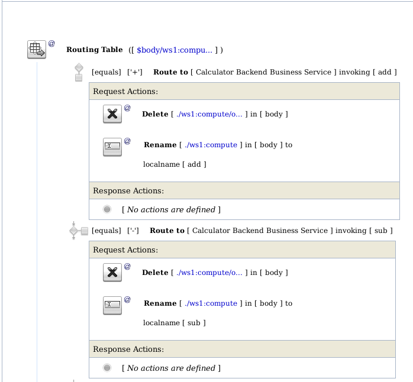
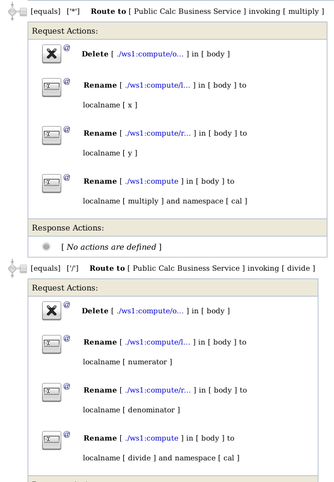
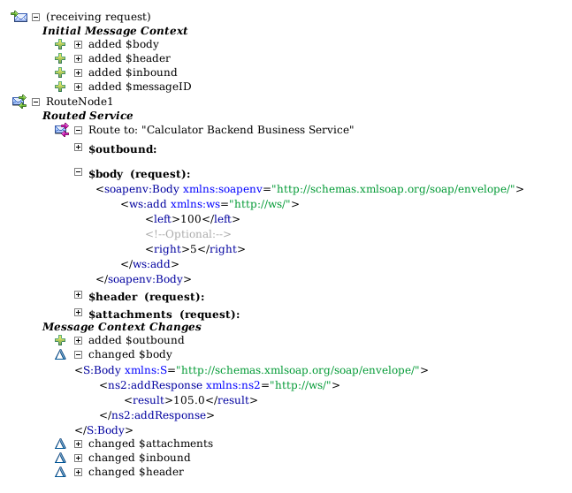
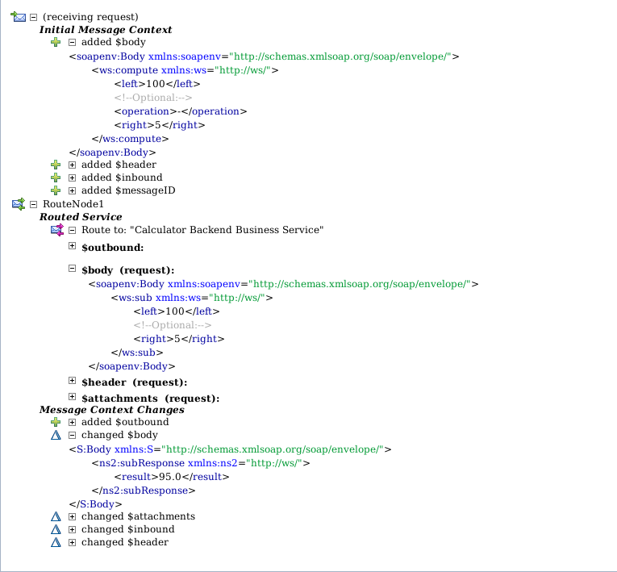
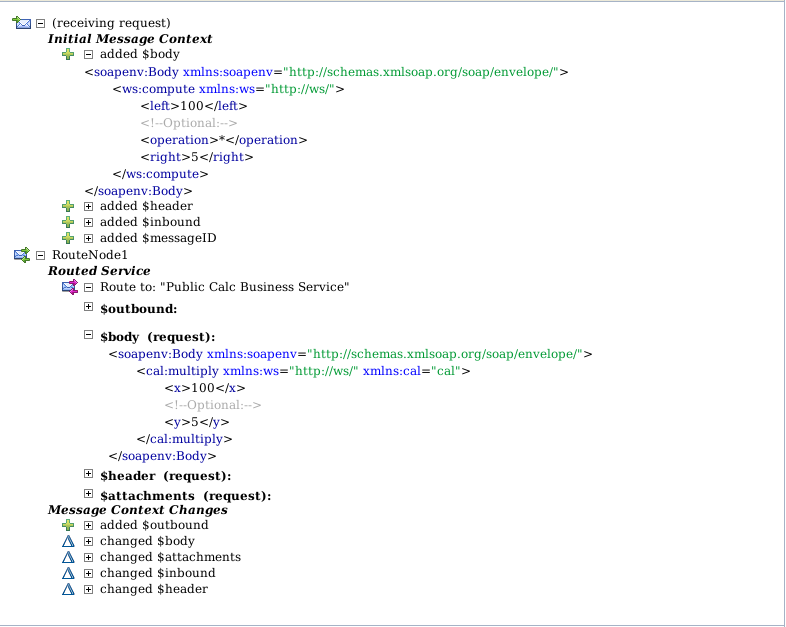
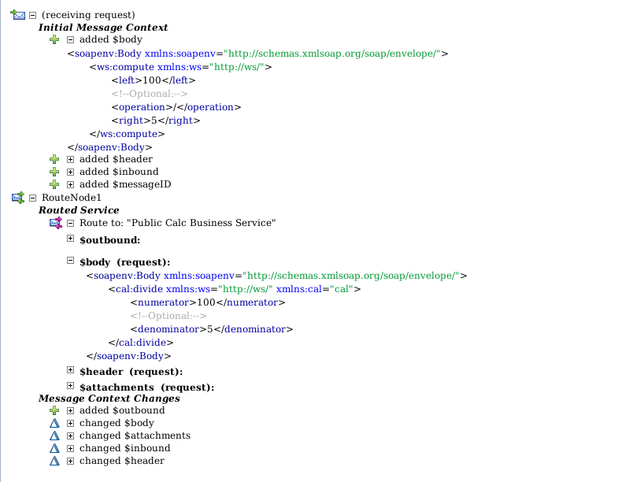

# Homework 6: OSB - Transformation #
## Screenshots ##

### Routing ###

### Message invokation ###
#### Operation + ####

#### Operation - ####

#### Operation * ####

#### Operation / ####

## Source codes ##
Source codes are located in netbeans_project directory. Project was build using Netbeans 8 IDE.
Oracle Service bus configuration file is sb_11_sbconfig.jar. 
