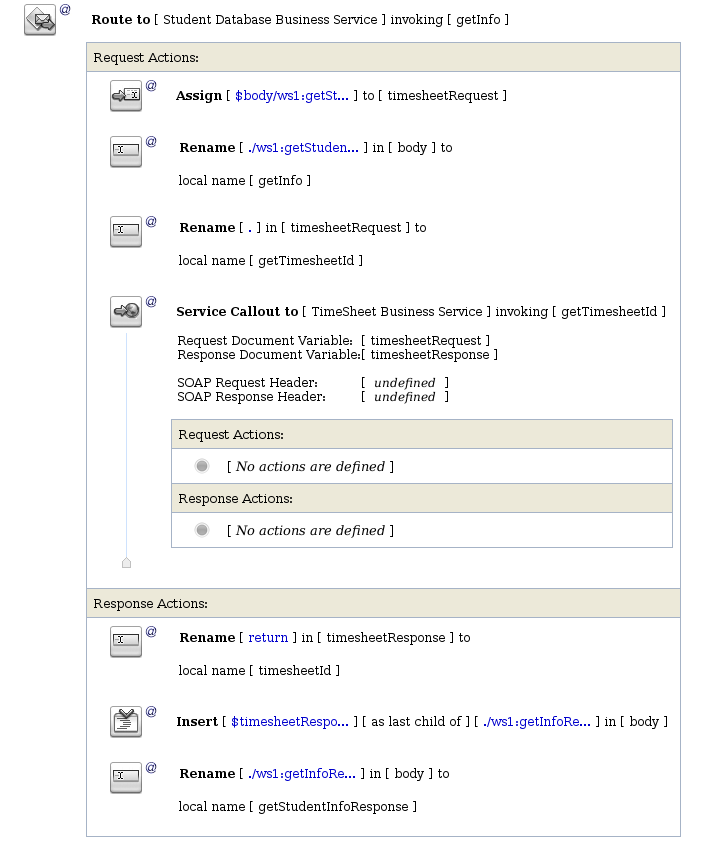

# Homework 7: OSB - Service Callout #

## Screenshots ##

### Proxy service ###

### Routing ###

### Message invokation ###

### Message context ###

## Source codes ##

Source codes are located in netbeans_project directory. Project was build using Netbeans 8 IDE. 

Oracle Service Bus configuration is in sbconfig.jar file. 

>Oracle Service Bus Version: [Oracle Service Bus 11.1 Fri Mar 8 04:05:15 PST 2013 1514631]

>Oracle Weblogic Server Version: [WebLogic Server 10.3.6.0 Tue Nov 15 08:52:36 PST 2011 1441050 ]
